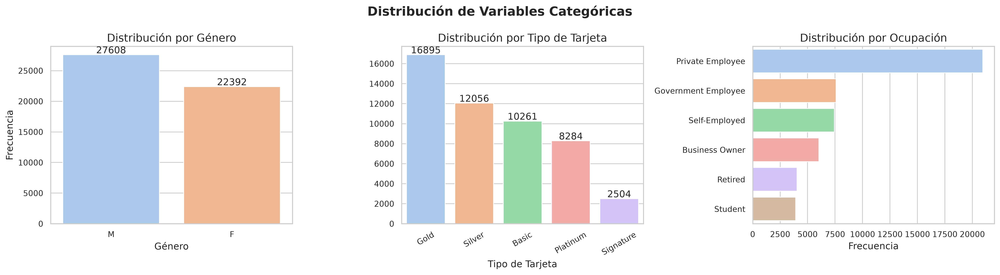
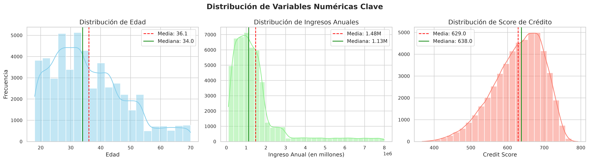
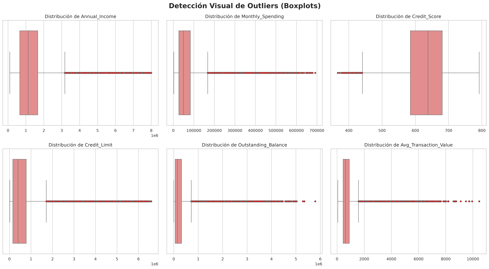
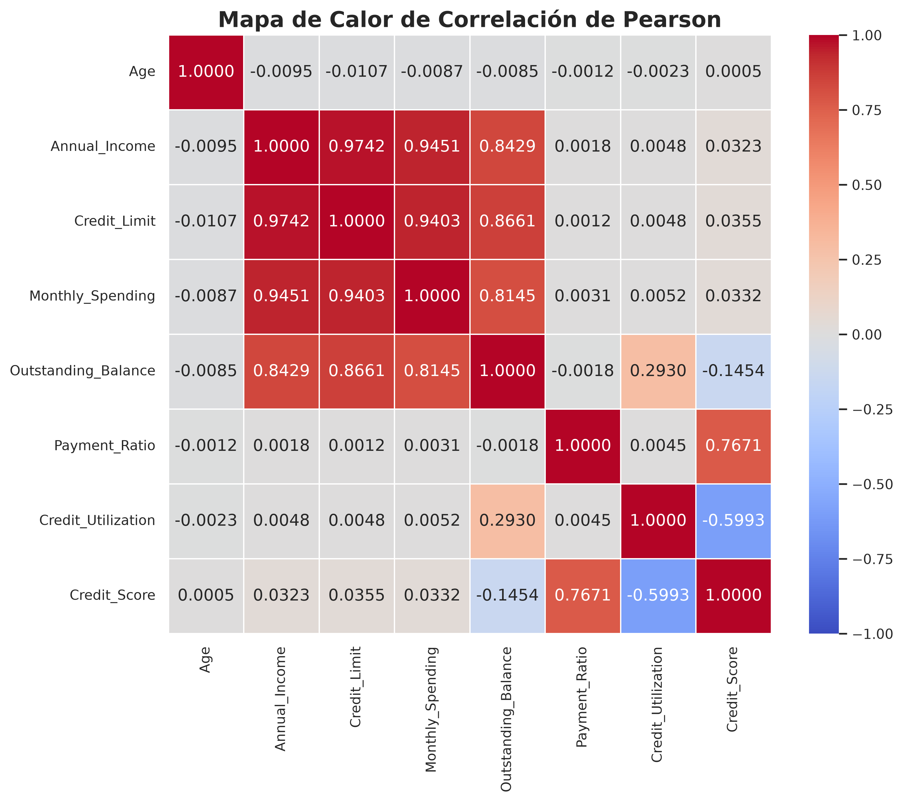
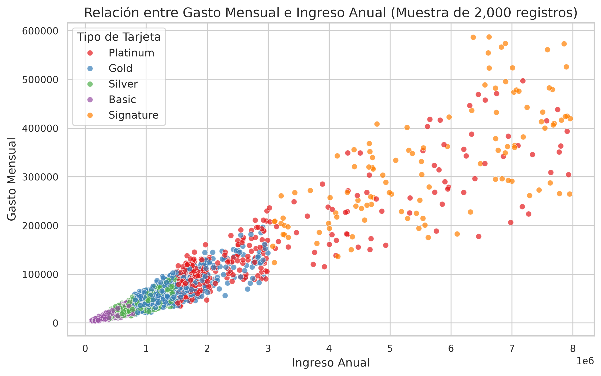
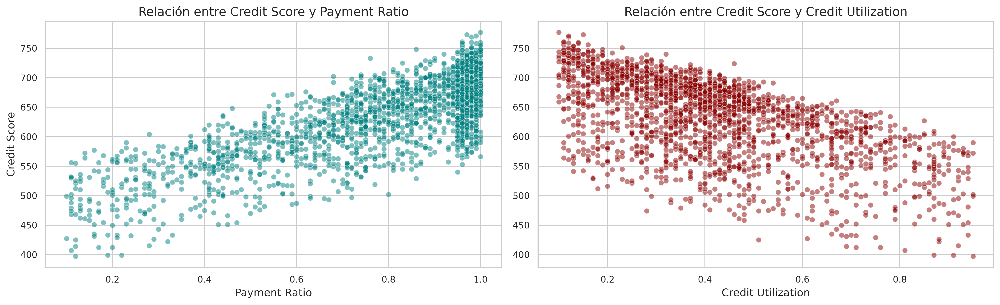
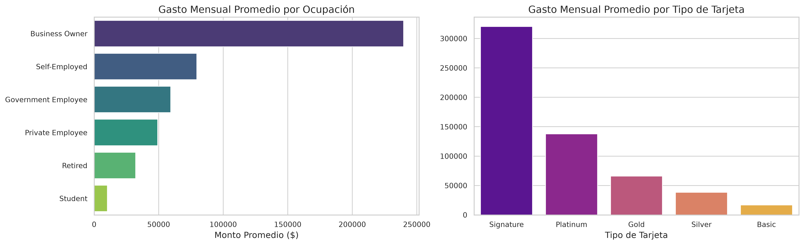

# Reporte de Análisis Exploratorio de Datos (EDA)
## Segmentación y Comportamiento de Clientes de Tarjetas de Crédito

Este documento presenta un reporte analítico detallado del conjunto de datos **Credit Card Customer Behavior Segmentation Dataset**. La información contenida en este archivo se extrajo y consolidó a partir del análisis realizado en el cuaderno interactivo [`Analisis_Exploratorio_Tarjetas_Credito.ipynb`](Analisis_Exploratorio_Tarjetas_Credito.ipynb).

---

## 1. Contexto del Dataset y Comprensión General

El conjunto de datos consta de **50,000 registros** y **30 variables**, sin presencia de valores nulos (0% de datos faltantes), lo cual denota su naturaleza sintética.

*   **Origen y Propósito**: Diseñado por Dharmendra Pandit (ingeniero de software radicado en Jaipur, India) utilizando reglas de negocio bancarias y distribuciones estadísticas realistas. Está pensado para ejercicios de análisis de datos, clasificación, regresión y segmentación de clientes.
*   **País y Moneda**: Los importes monetarios y límites están basados en la **Rupia India (INR - ₹)**.
    *   *Evidencia analítica*: El ingreso anual promedio (`Annual_Income`) es de aproximadamente ₹1.47 millones (~17,500 USD) y el límite de crédito promedio (`Credit_Limit`) es de ₹709,000. Si estas cifras se interpretaran en dólares estadounidenses (USD) o euros (EUR), estaríamos analizando un segmento exclusivo de ultra-riqueza con límites de crédito desproporcionados para el consumo minorista estándar. La escala se ajusta con total realismo al contexto bancario indio.
*   **Puntaje Crediticio**: El puntaje crediticio (`Credit_Score`) varía entre 367 y 792, lo cual imita fielmente el rango estándar de agencias indias como CIBIL (que oscila entre 300 y 900 puntos).

---

## 2. Diccionario de Variables y Clasificación Estadística

A continuación se detalla la traducción al español, descripción y clasificación técnica de cada una de las 30 variables:

| Variable Original | Traducción al Español | Descripción y Rango de Valores | Clasificación Estadística |
| :--- | :--- | :--- | :--- |
| **Customer_ID** | Identificador de Cliente | Código alfanumérico único para cada cliente. | Cualitativa Nominal |
| **Age** | Edad | Edad del cliente (18 a 70 años). | Cuantitativa Discreta |
| **Gender** | Género | Sexo biológico del cliente (M = Masculino, F = Femenino). | Cualitativa Nominal |
| **Annual_Income** | Ingresos Anuales | Ingreso anual estimado en rupias (INR). | Cuantitativa Continua |
| **Occupation** | Ocupación | Sector de ocupación (6 tipos: Student, Retired, Private Employee, Government Employee, Self-Employed, Business Owner). | Cualitativa Nominal |
| **Card_Type** | Tipo de Tarjeta | Categoría de la tarjeta de crédito (Basic, Silver, Gold, Platinum, Signature). | Cualitativa Ordinal |
| **Credit_Limit** | Límite de Crédito | Límite máximo de gasto asignado a la tarjeta (INR). | Cuantitativa Continua |
| **Card_Age_Months** | Antigüedad de la Tarjeta | Tiempo desde la emisión de la tarjeta en meses. | Cuantitativa Discreta |
| **Monthly_Spending** | Gasto Mensual | Monto total gastado en el último mes (INR). | Cuantitativa Continua |
| **Monthly_Transactions** | Transacciones Mensuales | Cantidad de compras ejecutadas en el mes actual. | Cuantitativa Discreta |
| **Avg_Transaction_Value** | Valor Promedio de Transacción | Monto medio de las compras individuales (INR). | Cuantitativa Continua |
| **Online_Shopping_Spending** | Gasto en Compras en Línea | Gasto mensual en comercio electrónico y sitios web (INR). | Cuantitativa Continua |
| **Grocery_Spending** | Gasto en Supermercado | Gasto mensual en abarrotes y víveres (INR). | Cuantitativa Continua |
| **Fuel_Spending** | Gasto en Combustible | Gasto mensual en gasolineras/combustible (INR). | Cuantitativa Continua |
| **Dining_Spending** | Gasto en Restaurantes | Gasto mensual en comida fuera de casa (INR). | Cuantitativa Continua |
| **Travel_Spending** | Gasto en Viajes | Gasto mensual en aerolíneas, hoteles y turismo (INR). | Cuantitativa Continua |
| **Entertainment_Spending** | Gasto en Entretenimiento | Gasto mensual en ocio, cine y suscripciones (INR). | Cuantitativa Continua |
| **Utility_Bill_Spending** | Gasto en Servicios Públicos | Gasto mensual en servicios domésticos (luz, agua, gas, internet) (INR). | Cuantitativa Continua |
| **Outstanding_Balance** | Saldo Pendiente | Deuda total acumulada a la fecha de consulta (INR). | Cuantitativa Continua |
| **Statement_Balance** | Saldo al Corte | Monto facturado en el último estado de cuenta (INR). | Cuantitativa Continua |
| **Payment_Amount** | Monto del Pago | Pago mensual efectuado por el cliente (INR). | Cuantitativa Continua |
| **Payment_Ratio** | Tasa de Pago | Proporción de la deuda facturada pagada en el mes (`Payment_Amount / Statement_Balance`). | Cuantitativa Continua |
| **Credit_Utilization** | Utilización del Crédito | Proporción del límite de crédito total utilizado (`Outstanding_Balance / Credit_Limit`). | Cuantitativa Continua |
| **Cash_Advance_Amount** | Adelanto de Efectivo | Monto total retirado en efectivo usando la tarjeta (INR). | Cuantitativa Continua |
| **EMI_Count** | Número de Cuotas (EMI) | Número de compras activas diferidas a plazos mensuales. | Cuantitativa Discreta |
| **International_Transactions** | Transacciones Internacionales | Cantidad de transacciones fuera de la India. | Cuantitativa Discreta |
| **Reward_Points_Earned** | Puntos de Recompensa Ganados | Puntos acumulados en el mes actual por transacciones. | Cuantitativa Discreta |
| **Reward_Points_Redeemed** | Puntos de Recompensa Canjeados | Puntos de recompensa canjeados por el usuario. | Cuantitativa Discreta |
| **Mobile_App_Login** | Inicios de Sesión en la App | Frecuencia de acceso mensual a la aplicación móvil del banco. | Cuantitativa Discreta |
| **Credit_Score** | Puntaje Crediticio | Calificación de riesgo del cliente (escala estándar 300-900). | Cuantitativa Discreta |

---

## 3. Limpieza de Datos e Integridad Lógica

Se evaluaron registros duplicados e inconsistencias matemáticas entre fórmulas clave del negocio financiero:

*   **Duplicados**: Se confirmaron **0 registros duplicados globales** y **0 identificadores únicos (`Customer_ID`) duplicados**.
*   **Consistencia de Ecuaciones Financieras**:
    1.  **Payment_Ratio**: La relación teórica (`Payment_Amount / Statement_Balance`) coincide casi al 100% con la variable original, con una diferencia media absoluta insignificante de `2.58e-08`.
    2.  **Credit_Utilization**: Muestra una diferencia media de `0.0064` (0.64%) respecto al cálculo teórico (`Outstanding_Balance / Credit_Limit`), lo cual representa ligeros desvíos por redondeo introducidos en la generación sintética.
    3.  **Monthly_Spending vs. Subcategorías**: La suma de las 7 subcategorías de gasto (Online, Grocery, Fuel, Dining, Travel, Entertainment, Utilities) presenta una diferencia media absoluta de **₹0.0051** respecto al gasto total mensual (`Monthly_Spending`). La discrepancia máxima detectada fue de apenas **₹0.03**, lo que evidencia consistencia matemática interna y leves variaciones decimales.
*   **Inconsistencia Biográfico-Temporal Crítica**:
    *   Se identificó que **6,452 clientes (12.90% del total)** obtuvieron su tarjeta de crédito antes de cumplir la edad legal de 18 años (calculado como: `Age - (Card_Age_Months / 12) < 18`). Este es un hallazgo importante que revela una limitación en el algoritmo de simulación del dataset y debe ser tomado en cuenta para la enseñanza.

---

## 4. Análisis Univariado

### A. Distribución de Variables Categóricas
*   **Género**: Muestra un ligero predominio de hombres con **27,608 registros (55.22%)** frente a **22,392 mujeres (44.78%)**.
*   **Tipo de Tarjeta**: La categoría más frecuente es **Gold (33.79%)**, seguida por **Silver (24.11%)**, **Basic (20.52%)**, **Platinum (16.57%)** y, por último, **Signature (5.01%)**.
*   **Ocupación**: Los empleados del sector privado representan la gran mayoría del conjunto de datos con un **41.92% (20,960 clientes)**. Los demás sectores se encuentran distribuidos homogéneamente:
    *   *Empleado del Gobierno*: 15.19%
    *   *Autoempleado*: 14.88%
    *   *Dueño de Negocio*: 12.08%
    *   *Jubilado*: 8.09%
    *   *Estudiante*: 7.84%

### B. Distribución de Variables Numéricas Clave
*   **Edad (`Age`)**:
    *   *Media*: 36.1 años | *Mediana*: 34.0 años | *Rango*: 18 a 70 años.
    *   *Comportamiento*: Existe un sesgo positivo hacia clientes más jóvenes, concentrándose la mayor frecuencia entre los 25 y 45 años.
*   **Ingresos Anuales (`Annual_Income`)**:
    *   *Media*: ₹1.48 millones | *Mediana*: ₹1.13 millones | *Rango*: ₹100,050 a ₹7.99 millones.
    *   *Comportamiento*: Distribución log-normal típica de ingresos, con un sesgo positivo pronunciado donde la mayoría de los usuarios se ubican en el rango de ₹500,000 a ₹1,800,000.
*   **Score de Crédito (`Credit_Score`)**:
    *   *Media*: 629.0 puntos | *Mediana*: 638.0 puntos | *Rango*: 367 a 792 puntos.
    *   *Comportamiento*: Distribución aproximadamente normal, con una concentración masiva de clientes en la categoría de riesgo medio-alto (entre 580 y 680 puntos).

---

## 5. Detección de Valores Atípicos (Outliers)

Se aplicó el método estadístico del Rango Intercuartílico (IQR) con un factor de `1.5` para identificar valores atípicos. A continuación se presentan las estadísticas exactas obtenidas:

| Variable | Rango IQR (Q1 a Q3) | Límites de Aceptación | Cantidad Outliers Bajos | Cantidad Outliers Altos | Total Outliers (%) |
| :--- | :--- | :--- | :--- | :--- | :--- |
| **Annual_Income** | ₹657,774 - ₹1,663,624 | [-₹851,000, ₹3,172,399] | 0 (0.00%) | 4,037 (8.07%) | **8.07%** |
| **Monthly_Spending** | ₹26,646 - ₹83,030 | [-₹57,929, ₹167,605] | 0 (0.00%) | 4,213 (8.43%) | **8.43%** |
| **Credit_Score** | 585.0 - 681.0 | [441.0, 825.0] | 394 (0.79%) | 0 (0.00%) | **0.79%** |
| **Credit_Limit** | ₹157,000 - ₹779,000 | [-₹776,000, ₹1,712,000] | 0 (0.00%) | 4,173 (8.35%) | **8.35%** |
| **Outstanding_Balance** | ₹55,641 - ₹319,978 | [-₹340,864, ₹716,484] | 0 (0.00%) | 4,570 (9.14%) | **9.14%** |
| **Avg_Transaction_Value** | ₹448.38 - ₹901.25 | [-₹230.94, ₹1,580.57] | 0 (0.00%) | 4,286 (8.57%) | **8.57%** |

*Análisis*: Las variables financieras presentan valores atípicos exclusivamente en el extremo superior (~8-9% de la muestra), debido al fuerte sesgo positivo propio de variables de ingresos y consumo. Por el contrario, la variable `Credit_Score` solo presenta outliers en el extremo inferior (0.79% de los registros con puntajes inferiores a 441), lo que representa a clientes con perfiles de muy alto riesgo crediticio.

---

## 6. Análisis Bivariado y Multivariado

### A. Correlaciones Lineales (Pearson)
Se calcularon las correlaciones entre las variables clave. Destacan los siguientes hallazgos:
*   `Credit_Score` tiene una fortísima correlación positiva con `Payment_Ratio` (clientes que pagan mayor porcentaje de su deuda tienen mejor score).
*   `Credit_Score` tiene una fuerte relación lineal negativa con `Credit_Utilization` (el sobreendeudamiento y alta utilización del límite reducen drásticamente la calificación).
*   Las variables sociodemográficas (edad, ocupación) no tienen correlaciones lineales significativas con el comportamiento de gasto o límite, lo cual sugiere que la segmentación sigue reglas estrictamente estructuradas según el tipo de tarjeta y sector laboral.

### B. Segmentación Ocupación vs. Tipo de Tarjeta
La relación porcentual en la asignación de tarjetas según la ocupación revela reglas determinísticas del algoritmo de generación sintética:

| Ocupación | Basic (%) | Gold (%) | Platinum (%) | Signature (%) | Silver (%) |
| :--- | :---: | :---: | :---: | :---: | :---: |
| **Business Owner** | 0.00% | 15.63% | 39.65% | 41.47% | 3.25% |
| **Government Employee** | 8.47% | 46.32% | 17.79% | 0.00% | 27.43% |
| **Private Employee** | 17.19% | 39.62% | 11.02% | 0.00% | 32.17% |
| **Retired** | 33.83% | 25.43% | 0.00% | 0.00% | 40.75% |
| **Self-Employed** | 9.76% | 41.65% | 29.97% | 0.00% | 18.62% |
| **Student** | 100.00% | 0.00% | 0.00% | 0.00% | 0.00% |

*Interpretaciones de Negocio Clave*:
1.  **Estudiantes (Students)**: Tienen **100% de asignación en tarjetas Basic**. No se les permite acceder a categorías de crédito superiores debido a la falta de ingresos constantes.
2.  **Dueños de Negocios (Business Owners)**: Concentran la totalidad de las tarjetas **Signature (41.47%)**, lo que denota una regla de alto patrimonio. No poseen tarjetas `Basic`.
3.  **Jubilados (Retired)**: Muestran una concentración de tarjetas de bajo límite (Basic y Silver suman **74.58%**) y poseen **0.00%** de tarjetas Platinum o Signature.

### C. Relación Gasto Mensual e Ingreso Anual
Al cruzar los niveles de consumo con los ingresos, coloreando por el tipo de tarjeta, se observa visualmente cómo el límite de crédito segmenta el potencial de gasto de los clientes. Los clientes Gold y Platinum muestran bandas de gasto linealmente proporcionales a su nivel de ingresos.

### D. Relación de Credit Score con Payment Ratio y Credit Utilization
Se confirma que los mejores puntajes crediticios se localizan en clientes con alta tasa de pago y baja tasa de uso del límite crediticio.

### E. Gasto Mensual Promedio por Ocupación y Tarjeta
*   Por **Ocupación**: Los *Business Owners* (Dueños de Negocios) gastan en promedio significativamente más que los demás grupos debido a sus tarjetas de categoría premium. Los estudiantes registran el gasto promedio más bajo.
*   Por **Tipo de Tarjeta**: Se observa un incremento escalonado y regular en el consumo promedio a medida que se escala de tarjeta (*Basic -> Silver -> Gold -> Platinum -> Signature*).

---

## 7. Ingeniería de Características e Hipótesis de Negocio

Se crearon dos variables financieras relativas para evaluar el apalancamiento y el nivel de endeudamiento del cliente:
1.  **`Credit_Limit_to_Income`** (Relación Límite / Ingresos): Qué proporción de sus ingresos representa su línea de crédito.
2.  **`Debt_to_Income`** (Relación Deuda / Ingresos): Qué proporción de sus ingresos representa su deuda acumulada.

*Estadísticas Generales*:
*   La proporción promedio de la línea de crédito respecto al ingreso anual es de **0.368** (36.8%), fluctuando entre 15.8% y 82.5%.
*   El endeudamiento promedio (`Debt_to_Income`) es de **0.157** (15.7% del ingreso anual del cliente).

Al desglosar por **Tipo de Tarjeta**, se descubrió que la relación límite de crédito/ingreso es prácticamente una constante determinada por las reglas del negocio bancario:
*   **Basic**: `~17.99%` del ingreso.
*   **Silver**: `~28.00%` del ingreso.
*   **Gold**: `~39.98%` del ingreso.
*   **Platinum**: `~55.02%` del ingreso.
*   **Signature**: `~74.98%` del ingreso.

En cuanto al nivel de endeudamiento promedio por **Ocupación**:
*   Los **Business Owners** poseen el ratio deuda/ingreso más alto (**25.74%**), mientras que los **Students** poseen el más bajo (**7.64%**), lo cual es financieramente consistente.

---

## 8. Modelado Explicativo del Score Crediticio

Para determinar qué tan predictible es el puntaje crediticio a partir del comportamiento transaccional del cliente, se ajustó un modelo de regresión lineal utilizando `Payment_Ratio` y `Credit_Utilization` como variables independientes.

### Resultados del Modelo:
*   **Coeficiente de Determinación (R²)**: **0.9519** (el modelo explica el **95.19%** de la variabilidad del Score Crediticio).
*   **Ecuación del Modelo Encontrada**:

$$\text{Credit\_Score} = 546.48 + 219.97 \times \text{Payment\_Ratio} - 200.40 \times \text{Credit\_Utilization} + \epsilon$$

### Interpretación de los Coeficientes:
1.  **Intercepto (546.48)**: Un cliente que no ha realizado pagos en el mes (`Payment_Ratio` = 0) y tiene su línea de crédito saturada o al límite (`Credit_Utilization` = 1) comenzará con un score base de aproximadamente **546 puntos**.
2.  **Payment_Ratio (+219.97)**: Por cada incremento de 1.0 (pasar de 0% de pago a 100% de pago de la deuda facturada), el puntaje crediticio aumenta en promedio **220 puntos**.
3.  **Credit_Utilization (-200.40)**: Por cada aumento de 1.0 en la tasa de utilización del crédito (pasar de 0% de uso a 100% de saturación del límite), el puntaje crediticio disminuye en promedio **200 puntos**.

Este modelo demuestra que el dataset sintético fue construido bajo una regla lineal rígida de comportamiento de pagos e insolvencia para determinar el riesgo de crédito.